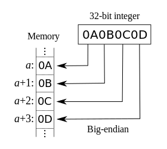

计算机只能处理数字，存储都是二进制的0和1  
文本在计算机上的存储，本质上还是转换成数字0和1再储存， 
这里就涉及到`字符编码`和`字符解码`的问题  
本文就文本字符的字符编码问题做个总结

## 字符集
字符编码所做的事情简单来说就是
> 将字符映射成计算机能处理的数字

这个映射是一一对应的关系的，每一个字符对应这一个数字，这种映射的标准称之为`字符集`或者`编码表`
 
最早统一标准的编码表是基于英文的，叫做`ASCII`(American Standard Code for Information Interchange)

ASCII编码表包含字符数较少，这很好理解，英文只有26个字母，分大小写也就52个，再加上一些标点符号，特殊字符 加起来不超过一百。于是采取了`单字节编码`的方式  

一个字节(byte), 也就是8位(bit), 除去最高位的符号位，剩下7位能表示 0-127 共128个数字。这个数量足够当时的需求  
按照ASCII编码的标准， `a`的对应值是`97`， `A`对应`65`，全部的映射关系如下：

<center>


</center>

前32位未非打印字符，现在已经用的很少了，可不关注  
后96位是具体的映射关系，表里给出了十进制，十六进制，八进制，html实体符号，实体字符等值

随着全球化的进程不断发展，单字节编码的128个字符显然不够用，随后便出现了很多定制化的编码表

- `ASCII` 占1个字节，只支持英文
- `EASCII` 占1个字节，将最高位利用起来，扩展至256个字符，支持英文和欧洲语言
- `GB2312` 占2个字节，支持6700+汉字
- `GBK` GB2312的升级版，支持21000+汉字
- `Shift-JIS` 日本字符
- `Euc-kr` 韩国编码
- `TIS-620` 泰国编码

大家都有了自己的标准，虽然都兼容ASCII字符集，但互相不兼容  

于是，一套统一的编码标准 [Unicode](http://www.unicode.org)应运而生, 中文称之为“万国码”，

Unicode(Universal Multiple-Octet Coded Character Set)简称`UCS`，是一个超大的字符集, 目标是包含全世界所有的字符，
每个字符对应一个数字，也称为码点(code point)  
当前最新的版本是2018年6月5日发布的 Unicode 11.0, 新增了 684 字符, 总共有 137,374 字符

Unicode是字符集，它有多种实现方案：
- `UTF-8`
    使用1、2、3、4个字节表示所有字符；优先使用1个字符、无法满足则使增加一个字节，最多4个字节。英文占1个字节、欧洲语系占2个、东亚占3个，其它及特殊字符占4个
    
- `UTF-16`(UCS-2的父集)
    使用2、4个字节表示所有字符；优先使用2个字节，否则使用4个字节表示
- `UTF-32`(等同于UCS-4)
    使用4个字节表示所有字符

准确来说，Unicode这个词仅表示编码方案，并不是具体的一种编码方式  
通常我们看到的Unicode编码其实是一种不太合适的说法，
更多的时候，他们想表达的其实是UTF-16或者UTF-8的具体编码实现  

比如Windows中文版里的记事本另存为时的编码选择列表：
<center>


</center>
这里的Unicode其实指的是UTF-16 little endian

大多时候存储会选择UTF-16的编码方式，传输会选择UTF-8

### UTF-8
UTF-16使用两个字节编码，基本能包含全世界所有的字符。 但是存储空间相对ASCII增加了一倍，显然这里是有很大的优化空间的  

UTF-8 采用其可变长编码，对于单字节字符仍然保持单字节编码， 节省空间，方便传输， 也因此成为使用最广泛的Unicode编码实现方案  

UTF-8编码的规则：
- 对于单字节的符号，最高位为`0`，后7位为它的Unicode码，这里完全兼容ASCII
- 对于`n`字节的符号`（n > 1）`，第一个字节的前`n`位都设为`1`，第`n + 1`位设为`0`，后面字节的前`两位`一律设为`10`。
    剩下的没有提及的二进制位，全部为这个符号的 Unicode 码
    

UTF-8这种编码方式本质上还是单字节编码，因为解析单个字节就可以知道它的组成  
例如解析一个字节高位为`0`, 那它肯定是个单字节字符  
如果最高位为`110`，那么可以肯定这是个两字节字符，当前字节和它后面的字节组成一个完整的字符编码  
如果是`10`开头的字节，那它肯定是一个字符编码的后半组成部分之一

### 字节序
多字节编码引入了字节顺序的问题，按理说这个应该统一标准的，但实在争议大到不可调和，所以就有了两个标准    

- Big Endian， 大端序， 最高位(Most Significant Bit, 简称MSB， 二进制里最左边的位) 存在最低的内存地址
    
- Little Endian， 小端序， 最低位(Least Significant Bit, 简称LSB, 二进制里最右边的位) 存在最低的内存地址
    

简单来说，可以将内存想象成线性增长的，当要存多个字节时，人们很纠结是先存低位的字节还是高位的字节  

我个人觉得既然二进制能定下来左边是高位，右边是低位，那符合直觉的应该先存高位再存低位啊，也就是现在的大端序  

但是站在小端序的立场想想，低位存低地址，高位存高地址，好像也没毛病…… 😲

whatever, as long as you're happy

### BOM
BOM(Byte Order Mark)字节序标记，顾名思义，表明当前多字节编码的字节序到底是大端还是小端

BOM一般出现在字节流的起始位置：
- UTF-8 的BOM 是`0xEF,0xBB,0xBF`， 这个标识不是用来说明大小端的，所以可以不带，带了可以表示当前的编码方式是utf-8
- UTF-16, 大端序的BOM是`0xFE 0xFF`, 小端序是`0xFF 0xFE`
- UTF-32, 规则和utf-16相同，但是因为是4字节为单位，所以高位两个字节为0

### Notepad++ 编码
再回头看Notepad++里的编码选项，应该就能看懂了  


ANSI 也是一种字符集，是非常老的编码规范，主要用于Windows 95/98 或者更老的操作系统上  
当时还没有Unicode，所以不支持，而现代操作系统基本都支持unicode了  
ANSI有很多套标准，具体使用时是指`本地系统的默认编码方式`，例如在windows 中文系统里，ANSI一般对应着`GBK`编码

总之，不推荐ANSI这种编码方式，该退出历史舞台的就让它随风而去吧

## 聊聊乱码
编码是将字符串根据字符集编码成对应的字符码加载到存储中  
解码是将存储中的字节流根据字符集的规则解析并显示成字符
> 正确的逻辑是用合适的方式编码，再以相同方式解码，这样显示才不会乱码

产生乱码的原因基本就两种：
- 使用错误的字符集将给定字符编码，这时一般会发生错误，比如用ASCII去编码中文
- 使用错误的字符集解码字节流，这时得到的字符一般为乱码，如用UTF-8解码GBK编码的字节

基于此通常会在文件开头标明编码方式，比如以HTML5的标准，html文件的头部的编码说明
```html
<meta charset="UTF-8">
```

还有比如Python的起始前两行也会有编码方式的说明等

只要使用了正确的编码方式，那么以相同的方式解码就没有问题  

?> 对于编码问题带来的乱码问题，通常推荐 `Unicode三明治模型`的做法：


> 程序操作的永远都是字节流转换之后的unicode 字符串, 操作处理完成之后，仍旧转换成之前编码形式下的字节流

这里的Unicode 字符串，存储的时候仍然是字节，不过它是世界通用的 Unicode标准编码的字节，
具体的编码实现可以是UTF-16 BE, 也可能是UTF-16 LE, 还可能是UTF-32, 会根据系统和平台而不同

根据 Unicode 和其他各个编码标准之间的映射关系，以Unicode为中间媒介, 实现了编码的动态转换

关于三明治模型几点补充：
- input 阶段必须知道字节流的原始编码方式，才能正确转换成 Unicode 字节
- output 阶段推荐的是转换成原始的编码方式，也可以动态的转换成其他的方式
