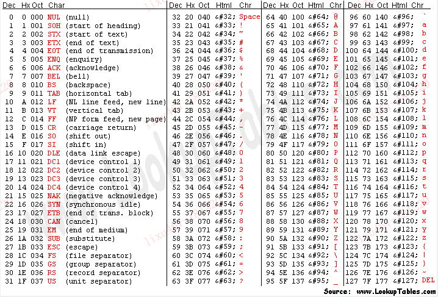

计算机只能处理数字，存储都是二进制的0和1  
文本在计算机上的存储，本质上还是转换成数字0和1再储存， 
这里就涉及到`字符编码`和`字符解码`的问题  
本文就文本字符的字符编码问题做个总结

## 字符集
字符编码所做的事情简单来说就是
> 将字符映射成计算机能处理的数字

这个映射是一一对应的关系的，每一个字符对应这一个数字，这种映射的标准称之为`字符集`或者`编码表`
 
最早统一标准的编码表是基于拉丁字母的，用于编码现代英文和欧洲语言，叫做`ASCII`(American Standard Code for Information Interchange)

ASCII编码表包含字符数较少，这很好理解，英文只有26个字母，分大小写也就52个，再加上一些标点符号，特殊字符 加起来不超过一百。于是采取了`单字节编码`的方式  

一个字节(byte), 也就是8位(bit), 除去最高位的符号位，剩下7位能表示0到127，总共128个数字。这个数量足够当时的需求  
举例来说， `a`的ASCII码对应值是`97`， `A`对应`65`，全部的映射关系如下：

前32位未非打印字符，现在已经用的很少了，可不关注  
后96位是具体的映射关系，表里给出了十进制，十六进制，八进制，html实体符号，实体字符等值

随着全球化的进程不断发展，单字节编码的128个字符显然不够用，随后便出现了很多定制化的编码表

- `ASCII` 占1个字节，只支持英文
- `GB2312` 占2个字节，支持6700+汉字
- `GBK` GB2312的升级版，支持21000+汉字
- `Shift-JIS` 日本字符
- `Euc-kr` 韩国编码
- `TIS-620` 泰国编码

大家都有了自己的标准，虽然都兼容ASCII字符集，但互相不兼容  
ASCII编码的机器上中文会显示乱码，GBK编码显示日文，韩文，泰文会乱码

于是，一套统一的编码标准 [Unicode](http://www.unicode.org)应运而生, 中文称之为“万国码”，

unicode(Universal Multiple-Octet Coded Character Set)简称`UCS`，是一个超大的字符集, 每个字符对应一个数字，也称为码点(code point)， 当前最新的版本是2018年6月5日发布的 Unicode 11.0, 新增了 684 字符, 总共有 137,374 字符

Unicode是字符集，它有多种实现方案：
- `UTF-8`
    使用1、2、3、4个字节表示所有字符；优先使用1个字符、无法满足则使增加一个字节，最多4个字节。英文占1个字节、欧洲语系占2个、东亚占3个，其它及特殊字符占4个
    
- `UTF-16`(UCS-2的父集)
    使用2、4个字节表示所有字符；优先使用2个字节，否则使用4个字节表示
- `UTF-32`(等同于UCS-4)
    使用4个字节表示所有字符

通常会选择UTF-8，因为节省空间，方便传输  

## 