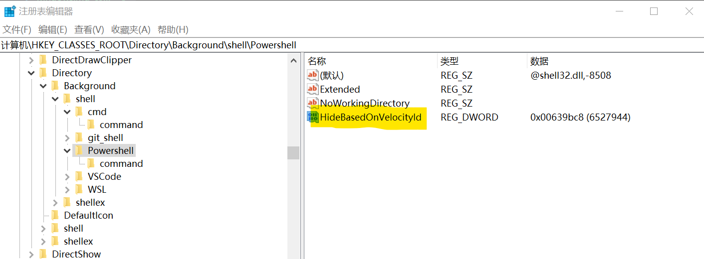

> `shift + 鼠标右击`, 显示此处打开命令行
    
win10 最新版本将默认的 cmd改成了 powershell，但是又不好用，可以手动修改回去
- `regedit` 打开注册表，到 `计算机\HKEY_CLASSES_ROOT\Directory\Background\shell\Powershell`下
- 修改 `ShowBasedOnVelocityId` 为 `HideBasedOnVelocityId`  

- 同理选中左侧目录上方的 `cmd`，将 `HideBasedOnVelocityId` 改为 `ShowBasedOnVelocityId`

?> 如果遇到权限问题，右击左侧目录选择`权限` -> `高级` -> 所有者，点击`更改`, 输入当前使用者邮箱。
改完后可以给对应 管理员或用户增加`完全控制`权限

> 添加开机启动项

命令行输入`shell:startup`, 进入到启动项目录，把需要添加的程序的快捷方式放进去即可。

