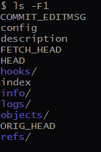

git被称为VCS(Version Control System)，然而与其他的一些产品原理上还是有一些差异。  

## 版本控制
把文件备份存储应该就是最初的版本控制原型，如果这有两个版本，这么做很方便，也合乎直觉。  
但随着版本的迭代，自然而然的发展到一个集中版本控制的地方，这里记录着每一个版本相对前一个版本的差异，
所有人都连接到一个集中的地方进行提交和更新。  
但慢慢的中心化的问题越来越尖锐，因为服务器挂了就玩不转了。  

去中心化的VCS有很多，核心就是基本所有的版本控制在本地完成，远程只是做一个同步记录。  
如果不打算共享或者和他人合作，基本不需要服务器的存在。  

记录变化的VCS工作原理图

行内容表示版本更迭，列内容表示具体的每一个版本存储的内容

git的原理仍然有点区别：    
> 每次产生新版本时， 对当前全部文件制作一个快照并存储快照索引，未变更的文件保留一个链接指向之前存储的文件。  

原理图如下：

仔细对比两张图的差异，git的做法简直“简单粗暴”，每次提交存储当前所有文件的内容。

## 快照
快照（snapshot）可以理解为“当前全部文件的全部内容”  
如上所说，每一个版本都会存储当前文件的所有内容即一个快照。内容没有变化的的单个文件会存链接，指向之前的内容。  
那如果新的版本相对旧版本，每个文件都做了一点点修改，就会存完整的两组文件。  
但这样的存储方式不是很浪费内存么？  
实际上Git 会做垃圾回收。原理也很简单，抽取并压缩两个内容相近对象的共同部分存在另外的位置（./.git/objects/pack）。    
这里帖一个stackoverflow的问题 [how-does-git-store-files](https://stackoverflow.com/questions/8198105/how-does-git-store-files)

## 数据存储
无论通过`git init`创建本地仓库还是`git clone`拉取远程仓库，
都可以看到本地目录下有个`.git`目录，这里存储了有关git的**所有数据**，
这个很好理解，在unix的世界里一切皆文件，需要备份或者迁移时，拷贝这个目录就可以了。  

打开`.git`目录，可以看看它的目录结构  

- COMMIT_EDITMSG, 包含了最后一次提交时的编辑信息
- config, 包含了该项目的独有配置信息，例如远程库地址等，使用git config 可修改变量值
- description, 文件仅供 GitWeb 程序使用，可不关心
- FETCH_HEAD, 记录当前可拉取的远程分支信息
- HEAD, 记录当前分支信息
- hooks, 包含客户端或服务端的钩子示例脚本
- index, 保存暂存区信息
- info, 包含一个文件，记录那些不希望被记录在 `.gitignore` 文件中的全局性排除信息
- logs, 记录了各个分支的操作历史信息
- objects, object database，存储所有数据内容的目录,每次提交的快照数据信息都存在这里
- ORIG_HEAD, 存储当前提交的上一次提交的哈希值信息
- refs, 存储指向数据（分支）的提交对象的指针目录

执行命令下面的命令可查看官方文档的详细说明
    
    git help gitrepository-layout

