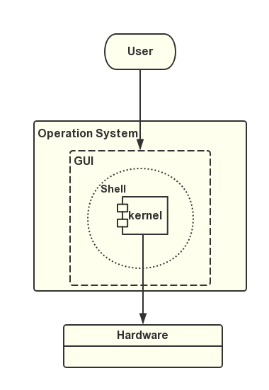

## 操作系统简介
> 以"下定义"的方式浅谈操作系统  

- 操作系统(Operation System)也是一个软件程序(software program)，开机启动运行，关机停止运行
- 操作系统是计算机系统的核心组成部分，负责管理硬件和软件资源
- 操作系统包括内核程序和外围接口程序(shell和GUI)，外围接口供用户使用驱动内核，内核程序操作硬件资源

图例：  
<center>


</center>

## 操作系统分类
- windows，最流行的个人操作系统
- unix，最早的一种多用户，多任务操作系统，由汇编语言编写，后用C语言重写。由于c语言的移植性较好，逐渐被移植到性能更好的硬件平台上，成为一种商业软件
- linux，一种以unix为原型，按照公开的POSIX标准重新编写的操作系统。由于借鉴了unix的思想，所以也称之为类unix系统。linux是自由软件，免费、公开源代码的

## Linux简介
呈上总结
- **类unix系统**，linux是自由软件，免费、公开源代码的类unix系统
- **linux内核**，严格来说，linux这个词，仅表示操作系统内核(kernel)。我们平常使用的linux系统均是围绕 linux 内核搭建出的上层系统，所以这样的系统有很多，一般称之为`发行版`

Linux大量使用了由麻省剑桥自由软件基金的GNU软件，同时Linux自身也是用它们构造而成,所以经常看到`GNU/Linux` 这样的标志。

## Linux 版本
- **内核版本**  
    执行命令
    ```shell
    uname -a
    ```
    返回结果示例
    > Linux sora 3.10.0-693.el7.x86_64 #1 SMP Tue Aug 22 21:09:27 UTC 2017 x86_64 x86_64 x86_64 GNU/Linux

    `3.10.0-693` 即为内核版本号，由三组数字组成
    - 第一个组数字：目前发布的内核主版本。
    - 第二个组数字：偶数表示稳定版本；奇数表示开发中版本。
    - 第三个组数字：错误修补的次数。短横杠后面接的数字表示微调(patch)次数

- **发行版本**  
    查看系统版本的方式就很多了，以centos为例  
    ```shell
    cat /etc/redhat-release
    ```
    > CentOS Linux release 7.4.1708 (Core) 

