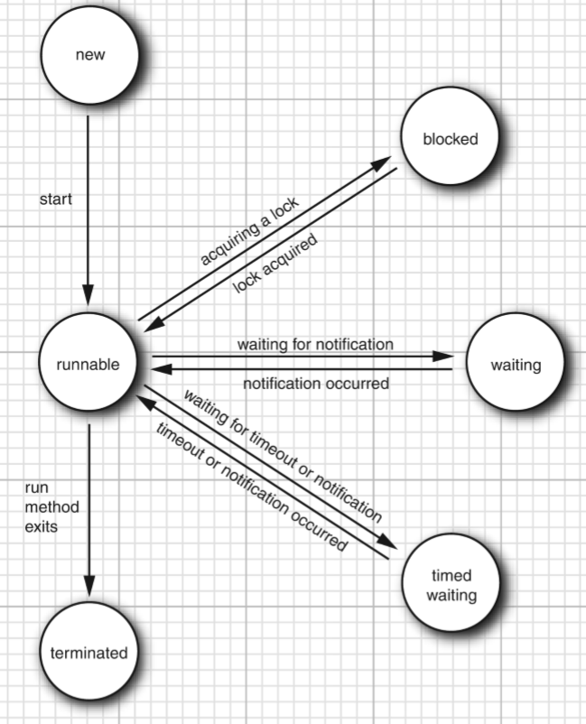

线程(thread)和进程(process)的概念不在赘述。


## 构造线程对象
Java 中提供`java.lang.Thread`类来构造和使用线程

Thread 接受一个 `Runnable`对象参数返回一个线程对象，eg：`new Thread(Runnable_obj)`。  
接着调用 `start`方法启动该线程，并行执行。  
该方法实际调用的是 `run`方法，关联着 Runnable对象的 run方法。  
**但不要直接调用 run方法**，直接调用只会在同一线程执行，不会开启新线程。

- Thread(Runnable target), 构建新线程 
- void start(), 启动新线程，调用run()方法，并发执行
- void join(), 等待线程结束
- void run(), 调用关联的 Runnable的 run方法
- static void sleep(long millis), 休眠


### Runnable 接口
`java.lang.Runnable`接口只有一个 run方法
```java
package java.lang;

@FunctionalInterface
public interface Runnable {
    void run();
}
```
因此实现该接口的类，重写 run方法即可。

下面根据API编写一个测试类
```java
public class MyRunnable implements Runnable{
    private String name;

    public MyRunnable(String name){
        this.name = name;
    }

    @Override
    public void run(){
        for(int i = 0; i<5; i++){
            System.out.println(name + ":" + i);
            try {
	            Thread.sleep((int) Math.random() * 10);
	        } catch (InterruptedException e) {
	            e.printStackTrace();
        	}
    	}
    }

    public static void main(String[] args){
        Thread thread1 = new Thread(new MyRunnable("A"));
        Thread thread2 = new Thread(new MyRunnable("B"));
        thread1.start();
        thread2.start();
    }
}
```
执行结果为:
```shell
B:0
A:0
B:1
A:1
B:2
A:2
B:3
A:3
B:4
A:4
```
上面的举例是标准的构建线程类对象的方法，当然也可以：
- 直接从 Thread类继承
- 重写 run方法
- 最后调用 start方法启动线程

但这种方法不推荐使用。因为这样将要执行的任务和线程类强耦合在一起。
每一个线程任务都需要写一个 Thread 子类，不方便也不符合直觉。

## 线程状态
线程有 6种状态：`New`, `Runnable`, `Blocked`, `Waiting`, `Timed waiting`, `Terminated`

- 通过 new 操作符，创建一个 Thread对象时，线程就处于新建(New)状态，还未执行
- 执行 start方法，线程处于可运行(Runnable)状态。注意，可运行不代表正在运行，是否运行
    取决于操作系统是否给线程提供运行时间，Java规范没有给正在运行的线程单独分配状态。
- 线程开始运行后不必始终保持运行。线程是可以被中断的，目的是给其它线程提供运行机会。  
- 当一个线程试图获取内部对象锁，而该锁被其它线程持有时，线程进入阻塞(Blocked)状态。  
    当所有其它线程释放该锁，且线程调度器允许本线程持有该锁时，该线程恢复可运行状态
- 线程有几个方法带有超时参数，例如 Thread.sleep, Thread.join等方法，调用会让线程进入计时等待状态。
- 当线程等待另一个线程时的某一结果时，它自己进入等待状态。例如几个线程都调用 Thread.join 方法，那么
    完成任务的线程即进入等待状态。
- 线程终止状态有两种情况。一是运行结束，正常终止。另外就是被一个没有捕获的异常中止。

线程状态之间的转换关系如下图：


可以调用用线程 `getState()`方法获取线程状态，返回值为 Thread.State对象

## 线程属性
线程有多个属性，包括： 线程优先级，是否为守护线程等
### 线程优先级
Java 中的每一个线程都有一个优先级。默认情况是继承父线程的优先级值。
较高优先级的线程会优先获取调度器的资源。  
可以调用线程实例方法 `setPriority`设置任何一个线程的优先级。  
优先级值范围是 1-10，`MIN_PRIORITY`定义为 1，`NORM_PRIORITY`定义为 5， `MAX_PRIORITY`为 10.  

但线程的优先级是高度依赖操作系统的，Java的优先级机制最后会被映射到宿主机平台的优先级上。

### 守护线程
调用线程实例方法 `setDaemon(true)`可以让一个线程转换为守护线程。但守护线程不同于守护进程。  
守护线程的唯一用途是给其它线程提供服务，例如定时发送计时信号给其它线程。  

### 未捕获异常处理器
线程的run方法调用过程中如果出现未捕获异常会导致线程终止。  
可以提供调用线程实例方法 `setUncaughtExceptionHandler`为线程安装一个异常处理器，
也可以用线程静态方法 `setDefaultUncaughtExceptionHandler`，给所有线程实例设置一个默认处理器。  
如果不安装处理器，默认为空。